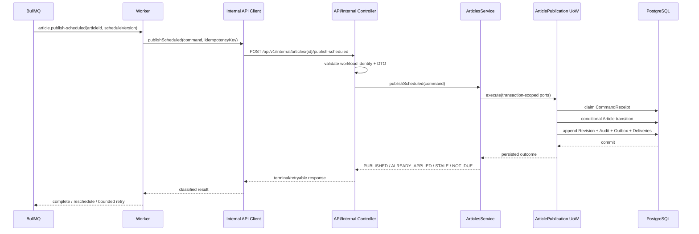

# 2026-08-12 Worker、事务事件与 Prisma 边界解决方案

## 1. 文档状态

| 项目 | 内容 |
| --- | --- |
| 状态 | Accepted；阶段 0～3 已实施，阶段 4～6 待执行 |
| 任务级别 | L3 分阶段工程交付 |
| 模式 | 阶段 3 已完成内部命令 API、生成客户端、Worker publisher 与真实 PostgreSQL 验证 |
| 项目路径 | `/mnt/d/ideaproj/blog` |
| 分支/提交 | Git 已初始化；按用户授权边界保留未提交状态，未执行 commit/push |
| 最后更新 | 2026-08-12（Asia/Shanghai） |
| 相关提案 | ADR-0011、ADR-0012、ADR-0013 |

## 2. 需求与结论

### 2.1 目标

解决以下互相关联的设计缺口：

1. Worker 如何执行权威业务状态转换，而不复制 API 业务规则或成为第二套后端；
2. PostgreSQL 事务提交后，如何可靠触发 BullMQ 派生任务；
3. Prisma 如何严格限制在持久化基础设施内，同时支持短事务和并发控制；
4. Article 与 ArticleRevision 的变更所有权和事务归属；
5. 跨域只读模型、外部/内部 API 类型和异步合同的权威来源。

### 2.2 唯一推荐方案

| 缺口 | 决策 |
| --- | --- |
| Worker 业务复用 | Worker 通过独立生成的私有 HTTP command client 调用 API；只有 API 执行业务转换。 |
| 事务事件可靠性 | PostgreSQL Transactional Outbox + 每消费者 Delivery + Inbox/Effect Ledger；语义为至少一次。 |
| Prisma 边界 | Prisma 只允许在命名的 persistence/infrastructure adapter 和领域专用 Unit of Work 内。 |
| 发布事务所有权 | ArticlesModule 统一拥有 Article 与 ArticleRevision 的变更语义。 |
| 跨模块事务 | 默认禁止；先调整所有权，确有必要时单独 ADR。 |
| 跨域读模型 | 允许只读 CQRS-lite projection，但必须有所有者且 Prisma 不得泄漏。 |
| HTTP 类型 | 外部和内部 OpenAPI 分别生成 client/types，禁止手写重复合同。 |
| 异步类型 | 狭窄的 versioned event/job contract 包，不依赖 NestJS、Prisma 或 app。 |

这套方案不引入微服务、Kafka、事件溯源、完整 CQRS、分布式事务或另一个 ORM。

## 3. 当前事实与缺口证据

项目现已包含可执行源码、Prisma schema/迁移、OpenAPI 和测试。以下表格保留最初缺口证据；阶段 0～2 的解决状态见第 14 节。

| 当前规则 | 缺口 |
| --- | --- |
| 业务模块全部运行在 `apps/api`，后台执行在 `apps/worker`。[`ADR-0007`](/mnt/d/ideaproj/blog/docs/architecture/adr/0007-use-modular-monolith.md:25) | 未定义 Worker 如何合法调用 API 中的权威状态转换。 |
| Worker 不得直接设置 `PUBLISHED`，必须执行 canonical transition。[`worker/AGENTS.md`](/mnt/d/ideaproj/blog/apps/worker/AGENTS.md:314) | 共享 application package、内部 API 或其他机制均未选定。 |
| 发布事务提交后产生 `ArticlePublishedEvent`。[`system-overview.md`](/mnt/d/ideaproj/blog/docs/architecture/system-overview.md:421) | commit 后的进程崩溃可能永久丢失内存事件。 |
| Redis 不是规范数据源。[`ADR-0008`](/mnt/d/ideaproj/blog/docs/architecture/adr/0008-use-redis.md:22) | BullMQ job 不能成为唯一、不可重建的派生任务记录。 |
| Prisma 必须位于持久化基础设施。[`ADR-0005`](/mnt/d/ideaproj/blog/docs/architecture/adr/0005-use-prisma.md:19) | `dependency-rules.md` 又保留 Service → Prisma 的模糊例外。[`dependency-rules.md`](/mnt/d/ideaproj/blog/docs/architecture/dependency-rules.md:290) |
| ArticlesModule 负责发布，ArticleRevisionsModule 负责修订行为。[`module-boundaries.md`](/mnt/d/ideaproj/blog/docs/architecture/module-boundaries.md:183) | 发布要求 Article + Revision 同事务，但没有跨模块 transaction context 契约。 |

## 4. 目标架构

```mermaid
flowchart LR
  Admin[Admin] --> ExternalClient[packages/api-client]
  ExternalClient --> API[apps/api]
  Scheduler[BullMQ scheduled job] --> Worker[apps/worker]
  Worker --> InternalClient[packages/internal-api-client]
  InternalClient --> InternalAPI[/api/v1/internal]
  InternalAPI --> API
  API --> Service[ArticlesService]
  Service --> UoW[ArticlePublicationUnitOfWork]
  UoW --> PG[(PostgreSQL)]
  PG --> Outbox[(outbox_event / delivery)]
  Outbox --> Dispatcher[Worker Outbox Dispatcher]
  Dispatcher --> Redis[(Redis / BullMQ)]
  Redis --> Consumers[Idempotent Worker Consumers]
  Consumers --> Inbox[(consumer_inbox)]
  Consumers --> Providers[Search / Cache / RSS / Mail / Storage]
```

严格边界：

- Worker 调用内部 API 完成业务命令；不导入 `apps/api/src/**`。
- Worker 不读取或修改 Article、Revision、User、Permission 等业务表。
- Worker 可通过专用 persistence adapter 访问 Outbox、Inbox、Delivery、Job Ledger 等基础设施表。
- API Service 不调用 Prisma/BullMQ/Redis SDK。
- 业务事务只做 PostgreSQL 工作。
- Redis 丢失后，可从 PostgreSQL 未 ACK 的 Delivery 重建任务。

## 5. 定时发布完整链路



### 5.1 内部命令接口

```http
POST /api/v1/internal/articles/{articleId}/publish-scheduled
Authorization: Bearer <short-lived workload token>
Idempotency-Key: article-publish-scheduled-<articleId>-<scheduleVersion>
X-Correlation-ID: <optional>
```

```json
{
  "contractVersion": 1,
  "scheduleVersion": 7
}
```

API 从 PostgreSQL 读取并验证：

- Article 是否存在；
- `status = SCHEDULED`；
- `scheduleVersion` 是否仍匹配；
- `publishAt <= database_now`；
- `deletedAt IS NULL`；
- 该命令是否已执行；
- 当前状态是否允许发布。

Worker 不提供可信的 `now`、状态、角色、用户或文章内容。

### 5.2 结果与重试语义

| 结果/错误 | Worker 行为 |
| --- | --- |
| `PUBLISHED` | 成功完成。 |
| `ALREADY_APPLIED` | 同一命令已经提交，成功完成。 |
| `STALE` | 已改期、取消、删除或被其他合法操作改变；成功跳过。 |
| `NOT_DUE` | 按 API 返回的 `retryAt` 延后。 |
| 网络超时、连接失败、`429`、可恢复 `5xx` | 使用同一 idempotency key 做有限退避重试。 |
| `401`/`403` | 停止盲目重试并安全告警。 |
| DTO/版本不支持、永久不存在 | 不重试，进入可检查的失败/DEAD 状态。 |

### 5.3 排期恢复

Redis/BullMQ 不是权威排期存储。Article 的状态、`publishAt` 和 `scheduleVersion` 保存在 PostgreSQL。

- 正常路径通过 durable Outbox Delivery 产生延迟 job。
- 周期 reconciliation job 调用有界的内部 API command，由 API 查找已到期但缺少有效 delivery/receipt 的排期并补建记录。
- Worker 不直接扫描或更新 Article 表。
- 旧 job 携带旧 `scheduleVersion`，由 API 返回 `STALE`。

## 6. 服务身份与安全边界

1. `/api/v1/internal` 不从公共反向代理暴露。
2. 所有内部调用使用 TLS。
3. 使用短期 workload token，校验 `iss`、`aud`、`sub`、`exp` 和 scope。
4. 建议身份：`sub=apps/worker`、`aud=blog-api-internal`、scope=`article.publish-scheduled`。
5. 不接受 Admin 用户 token，不模拟管理员。
6. API 使用固定系统主体 `article-scheduler` 写入审计。
7. token/secret 不进入 job payload、Outbox payload、错误摘要或日志。
8. 相同 idempotency key 配不同 request hash 返回稳定冲突错误。
9. 内部 DTO 仍执行严格 validation；Redis job payload 始终视为不可信。

平台具体的 workload identity/密钥签发与轮换机制，依据当前代码无法确认；实施前必须与部署平台能力对齐。

## 7. 事务、所有权与 Unit of Work

### 7.1 所有权决策

V1 将 ArticleRevision 定义为 Article 生命周期的不可变子实体/历史记录：

- ArticlesModule 拥有 Article 和 ArticleRevision 的 mutation semantics；
- create/update/publish/restore 所需 Revision 与 Article 在同一领域专用 UoW 中提交；
- revision list/compare/restore 是 ArticlesModule 的 query/application contract；
- 可导出窄 `ArticleRevisionReader`，不导出 mutable Revision repository；
- 删除独立 mutating `ArticleRevisionsModule` 的概念，避免人为跨模块事务。

### 7.2 Unit of Work 契约

```ts
type ArticlePublicationPorts = {
  articles: ArticleRepository
  revisions: ArticleRevisionRepository
  commandReceipts: CommandReceiptRepository
  audit: AuditWriter
  outbox: OutboxWriter
}

interface ArticlePublicationUnitOfWork {
  execute<T>(
    work: (ports: ArticlePublicationPorts) => Promise<T>,
  ): Promise<T>
}
```

约束：

- `ArticlesService` 负责业务分支和编排；
- `PrismaArticlePublicationUnitOfWork` 只负责创建/提交/回滚事务及 transaction-scoped adapter；
- callback 看不到 `Prisma.TransactionClient`；
- UoW 不含业务判断；
- 事务内不允许 HTTP、Redis、BullMQ、S3、搜索、邮件或 AI 调用；
- 并发正确性来自 PostgreSQL 条件更新/版本、唯一约束和 idempotency，不依赖 Redis lock。

### 7.3 跨模块写入

默认禁止跨模块 repository mutation：

- 跨域读通过窄 reader/query contract；
- 跨域写通过所有者 application command；
- 不向其他模块传递 Prisma transaction；
- 真正需要两个独立 aggregate 原子写入时，先重新评估 ownership；仍有必要则新增专门 ADR，不使用通用全局 transaction service 逃避设计。

本方案只定义一个窄例外：业务命令可通过 `AuditAppender`、`OutboxWriter`、`CommandReceiptWriter` 等由支持模块拥有的 transaction-scoped append-only port，在同一 UoW 中追加权威账本记录。

- 调用方看不到支持模块 Repository 或 Prisma transaction；
- port 只能 append，不能查询/修改另一业务 aggregate；
- persistence mapping 和 append semantics 仍由支持模块拥有；
- 该例外不能扩展成任意跨模块写入通道。

## 8. Prisma 严格边界

### 8.1 唯一允许位置

建议创建 backend-only `packages/database`，只拥有：

- `schema.prisma` 和 migration；
- generated Prisma client/lifecycle；
- 低层 transaction adapter primitive；
- 数据库测试 bootstrap。

Prisma 只可由命名的 API/Worker persistence/infrastructure 目录引用，例如：

```text
packages/database/**
apps/api/src/**/infrastructure/persistence/**
apps/api/src/**/repositories/prisma/**
apps/worker/src/infrastructure/persistence/**
```

### 8.2 明确禁止

以下位置不得导入 Prisma client、model、filter、input、transaction type：

```text
Controller
Guard
DTO / OpenAPI contract
domain / application Service
repository contract
Worker processor / job handler
Web / Admin
event/job contract package
```

删除现有文档中 `Service -> PrismaService` 的“窄例外”。确实需要 raw SQL 时，只能封装在命名 persistence adapter 内，并使用真实 PostgreSQL 集成测试。

### 8.3 自动执行

- `packages/eslint-config` 按路径设置 `no-restricted-imports`；
- 架构测试扫描 app/package/import 方向；
- CI 对 Worker→API 源码导入、Service→Prisma、前端→database/internal-client 直接失败；
- 代码评审规则不是唯一防线。

## 9. Transactional Outbox 设计

### 9.1 交付语义

```text
Article/Revision/Audit/CommandReceipt/Outbox/Delivery
                     同一 PostgreSQL 事务
                               ↓ commit
Worker Outbox Dispatcher -> BullMQ -> Idempotent Consumer
```

- PostgreSQL → BullMQ：至少一次；
- BullMQ → Consumer：至少一次；
- 允许重复、延迟和乱序；
- 不承诺 exactly-once；
- 数据库效果可通过唯一约束/同事务 Inbox 达到 effectively-once；
- 外部非幂等供应商仍可能在“调用成功、ACK 前崩溃”窗口重复。

### 9.2 事件信封

```ts
type IntegrationEventEnvelopeV1 = {
  envelopeVersion: 1
  eventId: string
  eventName: 'article.published'
  eventVersion: 1
  occurredAt: string
  aggregate: {
    type: 'article'
    id: string
    sequence: number
  }
  data: {
    articleId: string
    revisionId: string
  }
  metadata: {
    correlationId?: string
    causationId?: string
    actorId?: string
    traceparent?: string
  }
}
```

Payload 只保存 ID、版本和不可变引用；不保存正文、token、secret 或无关个人数据。

### 9.3 数据模型

#### `command_receipt`

| 关键字段 | 约束/用途 |
| --- | --- |
| `command_type`, `command_id` | 复合唯一；API 幂等边界 |
| `request_hash` | 同 key 不同请求检测 |
| `status`, `outcome`, `response_payload` | 返回既有结果 |
| `resource_id`, `created_at`, `completed_at`, `expires_at` | 诊断和保留 |

#### `outbox_event`

| 关键字段 | 约束/用途 |
| --- | --- |
| `id` UUID | 主键/稳定 event ID |
| `event_name`, `event_version` | versioned event contract |
| `aggregate_type/id/sequence` | 聚合身份、去重、顺序提示 |
| `payload`, `payload_hash` | minimal immutable envelope |
| correlation/causation/actor/trace | 可观测上下文 |
| `occurred_at`, `created_at` | 时间和保留 |

关键约束：event dedupe unique；aggregate + sequence index；aggregate 删除不级联删除历史事件。

#### `outbox_delivery`

| 关键字段 | 约束/用途 |
| --- | --- |
| `event_id`, `consumer_key` | 复合唯一；每消费者一条 |
| queue/job name | versioned destination |
| `status` | `PENDING/LEASED/ENQUEUED/ACKED/DEAD` |
| attempts/next attempt | dispatcher retry |
| lease owner/expiry | 多实例恢复 |
| BullMQ job ID / timestamps | 生命周期 |
| sanitized last error | 诊断 |
| replay count | 受控重放 |

关键索引：PENDING claim、expired lease、ENQUEUED unacked、DEAD operational index。

#### `consumer_inbox`

| 关键字段 | 约束/用途 |
| --- | --- |
| `consumer_key`, `event_id` | 复合主键；消费幂等边界 |
| `delivery_id`, `payload_hash` | delivery/envelope 校验 |
| `status` | `PROCESSING/RETRYABLE/COMPLETED/DEAD` |
| attempt/lease/timestamps | 并发和恢复 |
| aggregate identity/sequence | stale/order 判断 |
| sanitized last error | 诊断 |

### 9.4 Dispatcher 和 Consumer

Outbox Dispatcher 作为 `apps/worker` 的基础设施 runtime role：

1. 短事务领取有界的 PENDING/过期 lease Delivery；
2. 提交领取事务；
3. 事务外写 BullMQ；
4. 成功标记 ENQUEUED；失败按分类退避；
5. Reconciler 将过期 lease 或 Redis 中丢失的未 ACK job 重置为 PENDING；
6. BullMQ job ID 只降噪，Inbox/数据库唯一约束才保证正确性。

Consumer：

1. 校验 job/envelope version；
2. 原子 claim Inbox；已 COMPLETED 直接返回；
3. 需要业务状态时通过 private API projection reload；
4. 使用 current-state convergence、source version 或 provider idempotency key；
5. 成功后标记 Inbox COMPLETED、Delivery ACKED；
6. 永久错误进入 durable DEAD，人工 replay 不修改历史 payload。

权威安全审计必须在原业务事务写 PostgreSQL，不应仅作为异步消费者。

## 10. 合同与包边界

| 包 | 权威来源/用途 | 禁止事项 |
| --- | --- | --- |
| `packages/api-types` | 若保留，只能是 external OpenAPI 的 generator-owned type output | 不得手写重复 DTO |
| `packages/api-client` | external OpenAPI 生成，供 Web/Admin | 不包含 internal endpoint |
| `packages/internal-api-client` | internal OpenAPI 生成，仅供 Worker/backend tooling | Web/Admin 禁止依赖 |
| `packages/event-contracts` | versioned event/job envelope + runtime validation | 不依赖 NestJS、Prisma、app |
| `packages/database` | backend-only Prisma schema/client/transaction primitive | 不含业务 repository/service |
| `packages/schemas` | UI/跨应用辅助 validation | 不覆盖后端 DTO/OpenAPI 权威性 |

跨域 Read Model 规则：

- 位于消费方/所有者模块的 query persistence adapter；
- 只做 SELECT，返回 bounded projection DTO；
- 不暴露 Prisma record；
- 不注入 command handler 作为跨域 mutation 后门；
- 查询涉及的表、索引和集成测试必须记录。

## 11. 故障矩阵

| 故障 | 结果与恢复 |
| --- | --- |
| 业务事务回滚/提交前崩溃 | Article、Revision、Receipt、Audit、Outbox 全部不存在。 |
| commit 成功、HTTP 响应丢失 | 相同 key 重试，CommandReceipt 返回 ALREADY_APPLIED。 |
| 双 Worker 并发发布 | 条件更新/版本/唯一约束仅允许一个转换；另一个返回终态结果。 |
| Redis 在业务 commit 时不可用 | 业务 commit 成功，Delivery 保留在 PostgreSQL。 |
| Dispatcher 入队前崩溃 | lease 到期重新领取。 |
| 入队成功、ENQUEUED 标记前崩溃 | 可能重复入队；Inbox/target idempotency 消除重复效果。 |
| Redis 丢失已入队 job | Reconciler 从未 ACK Delivery 重建。 |
| BullMQ stalled/重复投递 | Inbox 去重/lease。 |
| job 乱序 | aggregate sequence + current-state convergence；旧版本跳过。 |
| DB 副作用事务中崩溃 | effect + Inbox 一起回滚。 |
| DB effect 已提交、BullMQ 未 ACK | 重投命中 COMPLETED Inbox。 |
| 外部 effect 成功、Inbox ACK 前崩溃 | provider/target idempotency；否则保留明确重复风险。 |
| 事件/合同版本不支持 | durable DEAD + 告警 + 授权人工 replay。 |
| 内部 API 401/403 | 停止盲目重试，按安全/部署故障告警。 |
| Consumer 长期停机 | backlog 增长；不回滚已提交业务状态。 |

## 12. 可观测性与运维

日志上下文至少包括：

```text
commandId eventId deliveryId eventName eventVersion
aggregateType aggregateId aggregateSequence
consumerKey queue jobName jobId
dispatchAttempt consumeAttempt replayCount
correlationId duration outcome errorClass
```

指标/告警至少包括：

- Outbox PENDING 数量和最老年龄；
- commit→enqueue、commit→ACK 延迟；
- expired lease、Redis job 重建数；
- Inbox duplicate、stale skip、sequence gap；
- BullMQ waiting/active/delayed/failed/stalled；
- 新增 DEAD、人工 replay；
- Outbox/Inbox 表大小和清理进度；
- workload token 鉴权失败。

保留策略必须可配置。Inbox 保留期必须长于最大 replay 窗口和 BullMQ job 保留期。PENDING、LEASED、ENQUEUED、未处理 DEAD 不得清理；清理使用有界批次。

## 13. 备选方案与拒绝理由

| 备选 | 结论 |
| --- | --- |
| Worker import `apps/api` Service/module | 拒绝：deployable app 不是库，破坏依赖和独立部署。 |
| 抽取完整共享 backend business package | V1 拒绝：冲突于业务模块归属，Worker 会组装第二套后端。 |
| API 内运行 BullMQ business consumer | V1 拒绝：后台生命周期与 HTTP app 耦合，改变 ADR-0007 runtime ownership。 |
| Worker 直接更新 Article/Revision | 拒绝：复制规则、事务、审计和事件。 |
| commit 后内存 emit / 直接 enqueue | 拒绝：存在不可恢复 dual-write 窗口。 |
| Service 直接 Prisma / 暴露 TransactionClient | 拒绝：ORM 泄漏且无法自动执行边界。 |
| Redis lock 作为发布正确性边界 | 拒绝：PostgreSQL 条件写和唯一约束才是权威。 |
| Kafka、2PC、事件溯源、完整 CQRS | V1 拒绝：超出需求并违反现有架构方向。 |

## 14. 分阶段实施计划

| 阶段 | 目标 | 主要产物 | 验收标准 | 当前状态 |
| --- | --- | --- | --- | --- |
| 0 | 架构确认 | 接受 ADR-0011/0012/0013；同步核心文档 | 规则无冲突、所有权唯一 | 已完成 |
| 1 | 工程/数据库基础 | Git/workspace；`packages/database`；Prisma schema/migration；lint 边界 | 新检出可构建；非法 import 在 CI 失败 | 已完成 |
| 2 | 权威发布事务 | Articles ownership；UoW；Receipt；Audit；Outbox/Delivery | 原子性、并发、幂等集成测试通过 | 已完成 |
| 3 | 内部命令 API | Internal Guard/OpenAPI/client；Worker publisher | 鉴权、响应丢失、STALE/NOT_DUE E2E 通过 | 已完成 |
| 4 | Outbox runtime | Dispatcher、Inbox、reconciler、DEAD/replay | Redis/进程故障测试恢复且无重复业务效果 | 未开始 |
| 5 | 首批消费者 | Search/revalidation/RSS 等 current-state handler | 重复/乱序/stale 测试通过 | 未开始 |
| 6 | 运维闭环 | dashboard、alerts、retention、runbook、replay audit | backlog/DEAD 可发现、可恢复、可审计 | 未开始 |

### 14.1 ADR 接受后应更新的现有文档

| 文件 | 更新内容 |
| --- | --- |
| `AGENTS.md` | 增加 `/api/v1/internal`、内部 client、严格 Prisma 边界、Outbox 语义。 |
| `apps/api/AGENTS.md` | Internal Guard、service actor、CommandReceipt、UoW、Outbox、禁止 Service→Prisma。 |
| `apps/worker/AGENTS.md` | 业务命令仅走 internal API；仅基础设施表可直连；HTTP 错误分类。 |
| `system-overview.md` | 替换 commit 后内存 event 表达；补完整可靠链路。 |
| `module-boundaries.md` | Revisions 归 ArticlesModule；跨模块 transaction 默认禁止。 |
| `dependency-rules.md` | 删除 Prisma 例外；允许 Worker→internal client；禁止 Worker→API source。 |
| ADR README | 登记 ADR-0011/0012/0013 状态。 |

## 15. 验证矩阵

### 15.1 静态/架构

- Prisma import 只能出现在允许路径；
- Worker 无 `apps/api/**` import；
- Web/Admin 无 internal client/database import；
- external/internal OpenAPI 客户端可重复生成且无手工 diff；
- event/job envelope runtime validation 覆盖未知版本。

### 15.2 PostgreSQL 集成

- 发布成功同时持久化 Article、Revision、Audit、Receipt、Outbox/Delivery；
- 任一步失败全部回滚；
- 同 idempotency key + 同 body 返回既有结果；
- 同 key + 不同 body 返回冲突；
- 双并发仅一个 publication/version/revision/outbox；
- raw SQL/locking adapter 在真实 PostgreSQL 验证；
- Delivery claim/lease 支持多 Dispatcher。

### 15.3 API/安全

- 合法 workload token + scope 可调用；
- 无 token、过期、错误 audience/scope 均拒绝；
- Admin token 不能调用 internal route；
- token/Authorization 不进入日志；
- DTO、未知版本、未知 Article 返回稳定错误；
- response-loss 后重试返回 ALREADY_APPLIED。

### 15.4 Worker/故障注入

- 旧 scheduleVersion 返回 STALE；
- NOT_DUE 精确延后且不形成重试风暴；
- Redis 在 commit 时不可用，数据库状态仍正确；
- Dispatcher 在 enqueue 前/后崩溃均恢复；
- Redis job 丢失由 Reconciler 重建；
- duplicate/stalled/out-of-order job 不重复业务效果；
- unsupported event 进入 DEAD；
- replay 有权限、原因、审计和新 replay generation。

### 15.5 阶段 3 验证边界

阶段 3 已在隔离的 `blog_test` PostgreSQL 18 数据库验证发布事务、内部 HTTP 鉴权、稳定错误、响应丢失重试、幂等冲突、STALE 与 NOT_DUE；Worker publisher 单元测试覆盖 payload 校验、终态、精确延后、不可恢复和瞬态错误分类。Outbox dispatcher/consumer、Redis 故障注入、DEAD/replay 与业务消费者仍属于阶段 4～6，尚未宣称完成。

## 16. 上线、回滚与清理原则

建议实施时按兼容顺序上线：

1. 先部署数据库表和兼容读取代码；
2. 部署 Worker dispatcher/consumer，保持消费关闭；
3. 部署 API UoW、Outbox 双写和 internal endpoint；
4. 开启 Outbox dispatch；
5. 开启 scheduled publish internal API path；
6. 观察 backlog、duplicate、DEAD 和 latency 后移除旧路径。

回滚：

- 通过独立 feature switch 停止 dispatcher/新 scheduled job，不删除 PostgreSQL ledger；
- 不回滚已经合法提交的 Article publication；
- 保留 Outbox/Inbox/Receipt 供恢复和审计；
- 禁止通过清空 Redis 或删 Outbox 解决积压；
- schema destructive cleanup 必须在稳定期后另行迁移。

阶段 2 可通过停止调用发布 command 回滚流量；已提交的合法发布和 ledger 不回退。新增 `schedule_version` 为兼容性非破坏字段，物理删除列需在后续稳定期单独迁移。

## 17. 残余风险与待确认项

1. 部署平台的 workload identity、token 签发和轮换机制尚未定义。
2. 外部邮件等供应商若不支持 idempotency key，仍存在调用成功后崩溃导致重复的窗口。
3. Outbox/Inbox 的具体重试次数、lease、保留期和告警阈值需依据实际流量确定，不能把初始默认值当永久真理。
4. 是否需要严格 per-aggregate delta ordering，应由具体 consumer 证明；默认采用最新状态收敛。
5. 阶段 2 的 PostgreSQL 事务缺口已闭合；Redis/BullMQ 故障恢复仍需阶段 4 完成后才能宣称闭合。

## 18. 批准门槛

建议同时接受 ADR-0011、ADR-0012、ADR-0013，因为三者共同形成闭环：

- 只接受 Worker internal API 而没有 Outbox，仍会丢派生事件；
- 只接受 Outbox 而不收紧 Prisma，Worker/Service 仍可能绕过边界；
- 只收紧 Prisma 而不明确 Worker command path，定时发布仍无合法执行入口。

批准后先更新现有架构规则，再进入阶段 1 工程实施。

## 19. Loop Compliance

| Gate | 状态 | 证据/原因 |
| --- | --- | --- |
| Scope | PASS | 用户要求聚焦 Worker、事务事件、Prisma 等设计缺口。 |
| Context | PASS | 已核查根/API/Worker 规则、ADR-0004～0010、system/module/dependency 文档。 |
| Architecture | PASS | 三项决策边界闭合，备选方案与冲突理由已记录。 |
| Security | PASS（设计） | workload identity、最小 scope、秘密/日志、401/403 语义已定义。 |
| Data | PASS（设计） | 原子事务、模型、约束、幂等、保留和回滚原则已定义。 |
| Report | PASS | 本方案及三份 Proposed ADR 已生成。 |
| Build/API/DB | PASS（阶段 2） | 全量 lint/typecheck/test/build 通过；`blog_test` 六个真实 PostgreSQL 事务场景通过。 |
| Worker runtime | PASS（阶段 3） | internal command endpoint、生成 client 与 Worker publisher 已实现；12 个 Worker 测试及 11 个真实 PostgreSQL API/事务场景通过。Outbox dispatcher 属于阶段 4。 |

### 19.1 Defect Loop Ledger

| 迭代 | 发现 | 根因 | 修复 | 重新验证 |
| --- | --- | --- | --- | --- |
| 1 | ADR README 出现 CRLF/LF 混合行尾 | 在原 CRLF 文件中插入了 LF 新行 | 将本次五份文档统一为项目现有 CRLF 行尾 | PASS：`file` 确认均为 CRLF；内容、链接、围栏和 ADR 状态复检通过 |
| 2 | 首次事务测试误用开发库并清理了空测试夹具 | 测试沿用 `DATABASE_URL`，未强制隔离数据库 | 新增 `blog_test`、`TEST_DATABASE_URL`、`_test` 名称硬保护和串行测试；开发库重跑幂等 seed | PASS：`blog_test` 六用例通过且测试后业务/ledger 表为空；开发库系统身份、角色和权限复核通过 |
| 3 | 并发发布返回 PostgreSQL `40001` | Serializable 事务正确阻止双写，但 adapter 未分类重试 | persistence UoW 增加最多 3 次 serialization retry，并将耗尽结果翻译为稳定错误 | PASS：并发测试得到一个 PUBLISHED、一个 STALE，仅一份 revision/audit/outbox |
| 4 | 生成内部 client 后 Worker 测试读取旧的 workspace `dist` | 直接执行 filtered test 不经过 Turbo 的 `^build` 依赖图 | 验收前构建 event-contracts/shared/internal client；README 记录根测试与 filtered test 差异 | PASS：Worker 12/12、全量测试通过 |
| 5 | Internal controller 默认返回 201 | NestJS `POST` 默认状态与 OpenAPI 200 合同不一致 | 显式 `@HttpCode(200)` 并重新生成 client | PASS：内部命令 E2E 的 PUBLISHED/ALREADY_APPLIED/STALE/NOT_DUE 均返回 200 |
| 6 | WSL 沙箱下 Next/Turbopack 构建尝试绑定内部端口时报 EPERM | 运行环境禁止 Turbopack CSS 子进程监听端口，与业务源码无关 | API/Worker/共享包按原命令构建；Web/Admin 使用 Next 官方 webpack 路径交叉验证 | PASS：两端均完成生产编译、类型检查、静态生成与 build trace；根 Turbopack 门禁保留环境限制记录 |

验证脚本调用方式中的两处参数问题已在同一轮纠正后重新执行，未发现文档链接或秘密泄漏问题。

知识沉淀：本方案、三份 ADR 和 README 的 workspace artifact 提示共同作为长生命周期记录。
