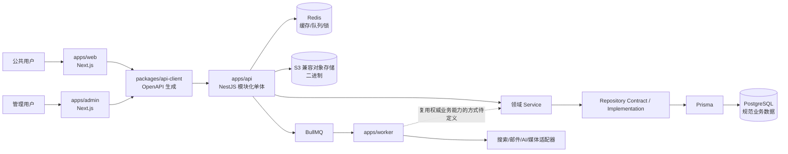

# Blog / CMS 项目架构与工程就绪度审计报告

> 审计结论：当前目录是较完整的“目标架构与 AI 协作规范基线”，不是可安装、构建、测试、运行或部署的 Blog 应用。项目处于工程脚手架开始之前；建议先闭合关键架构问题并建立可复现工程根，再实现一条最小纵向业务链路。

## 1. 报告信息

| 项目 | 内容 |
| --- | --- |
| 原始路径 | `D:\ideaproj\blog` |
| 当前环境映射 | `/mnt/d/ideaproj/blog` |
| 审计日期 | 2026-08-12（Asia/Shanghai） |
| 审计类型 | 源事实型架构与工程就绪度审计 |
| 版本依据 | 目录不是 Git 仓库，无法提供分支或提交号 |
| 变更范围 | 只生成本报告；未修改项目业务文件 |

## 2. 执行摘要

### 2.1 当前阶段

当前阶段应定义为：**架构基线已形成，工程实现尚未开始**。

- 目录内共有 19 个文件，全部为 Markdown，共 7,206 行，磁盘占用约 148 KB。
- 四个应用目录 `apps/web`、`apps/admin`、`apps/api`、`apps/worker` 均存在，但各自只有 `AGENTS.md`。
- 10 个 ADR 均为 `Accepted`，核心技术和边界已作出书面决策。
- 依据当前目录未发现源码、依赖清单、工作区配置、数据模型、迁移、测试、CI、运行配置或部署配置。
- `/mnt/d/ideaproj/blog` 不是 Git 工作树，无法进行版本追溯和工作树差异审计。

因此，本报告能评估“架构意图和开工条件”，不能评估任何功能、性能、安全或部署实现是否合格。

### 2.2 总体判断

| 维度 | 当前状态 | 判断 |
| --- | --- | --- |
| 架构方向 | 已定义 | 技术选型、应用职责、数据权威源和依赖方向较清晰 |
| 架构闭合度 | 部分闭合 | Worker 复用业务规则、跨模块事务和事件可靠性仍待明确 |
| 工程基础 | 未建立 | 无 Git、workspace、manifest、lockfile、工具配置 |
| 业务实现 | 未发现 | 四个应用没有 `src/` 或可执行入口 |
| 数据与 API | 未发现 | 无 Prisma schema/migration、OpenAPI 产物和生成客户端 |
| 自动验证 | 未发现 | 无测试、lint/typecheck/build 配置和 CI |
| 运行与交付 | 未发现 | 无环境模板、本地依赖编排、健康检查或部署材料 |
| 发布就绪 | 否 | 当前不能安装、构建、测试、运行或部署 |

## 3. 审计范围与证据

### 3.1 已检查材料

- 仓库级规则：[`AGENTS.md`](/mnt/d/ideaproj/blog/AGENTS.md:1)
- 应用级规则：
  - [`apps/web/AGENTS.md`](/mnt/d/ideaproj/blog/apps/web/AGENTS.md:1)
  - [`apps/admin/AGENTS.md`](/mnt/d/ideaproj/blog/apps/admin/AGENTS.md:1)
  - [`apps/api/AGENTS.md`](/mnt/d/ideaproj/blog/apps/api/AGENTS.md:1)
  - [`apps/worker/AGENTS.md`](/mnt/d/ideaproj/blog/apps/worker/AGENTS.md:1)
- 核心架构文档：
  - [`system-overview.md`](/mnt/d/ideaproj/blog/docs/architecture/system-overview.md:1)
  - [`module-boundaries.md`](/mnt/d/ideaproj/blog/docs/architecture/module-boundaries.md:1)
  - [`dependency-rules.md`](/mnt/d/ideaproj/blog/docs/architecture/dependency-rules.md:1)
- ADR 索引及 ADR-0001 至 ADR-0010 全部内容。
- 完整目录清单、文件类型、常见工程文件、源码目录、测试、数据库、CI 和部署材料。

### 3.2 证据边界

- 本报告将文档描述视为“目标架构”，不视为已实现能力。
- 凡磁盘中没有对应实现证据的能力，均表述为“依据当前代码未发现/无法确认”。
- 没有运行构建或测试，因为目录中不存在 `package.json`、源码或测试入口。
- 没有验证外部数据库、Redis、对象存储、搜索或 AI 服务。

## 4. 实际目录快照

```text
blog/
├── AGENTS.md
├── apps/
│   ├── admin/AGENTS.md
│   ├── api/AGENTS.md
│   ├── web/AGENTS.md
│   └── worker/AGENTS.md
└── docs/architecture/
    ├── dependency-rules.md
    ├── module-boundaries.md
    ├── system-overview.md
    └── adr/
        ├── README.md
        └── 0001...0010 共 10 个 ADR
```

### 4.1 未发现的关键工程产物

| 类别 | 检查结果 |
| --- | --- |
| `packages/` | 未发现 |
| 根 `package.json` | 未发现 |
| 应用/包 `package.json` | 未发现 |
| `pnpm-workspace.yaml` | 未发现 |
| `pnpm-lock.yaml` 或其他 lockfile | 未发现 |
| `turbo.json` | 未发现 |
| `tsconfig*.json` | 未发现 |
| `src/`、TS/JS 源文件 | 未发现 |
| Prisma schema、migration、SQL | 未发现 |
| OpenAPI 文件、生成客户端 | 未发现 |
| 单元/集成/E2E 测试和测试配置 | 未发现 |
| CI 配置 | 未发现 |
| `.env.example` 等环境模板 | 未发现 |
| Docker/Compose/其他部署配置 | 未发现 |
| 根级 `README.md` | 未发现 |

## 5. 文档定义的目标架构

以下是规划架构，不代表磁盘中已有实现。



### 5.1 应用职责

| 应用 | 目标职责 | 关键边界 | 来源 |
| --- | --- | --- | --- |
| `apps/web` | 公共博客、文章/分类/标签/归档/搜索、SEO、sitemap、RSS | Server Component 优先；不承载权威业务逻辑；只消费公共 API | [`system-overview.md:74`](/mnt/d/ideaproj/blog/docs/architecture/system-overview.md:74)、[`apps/web/AGENTS.md:15`](/mnt/d/ideaproj/blog/apps/web/AGENTS.md:15) |
| `apps/admin` | 登录、内容与媒体管理、权限、设置、分析、审计、AI 内容工具 | TanStack Query 管理 server state；前端权限仅改善 UX；后端授权权威 | [`system-overview.md:133`](/mnt/d/ideaproj/blog/docs/architecture/system-overview.md:133)、[`apps/admin/AGENTS.md:115`](/mnt/d/ideaproj/blog/apps/admin/AGENTS.md:115) |
| `apps/api` | 认证授权、业务规则、事务、数据库访问、缓存/搜索/AI 编排和队列生产 | Controller → Service → Repository → Prisma；按领域组织模块 | [`system-overview.md:199`](/mnt/d/ideaproj/blog/docs/architecture/system-overview.md:199)、[`apps/api/AGENTS.md:35`](/mnt/d/ideaproj/blog/apps/api/AGENTS.md:35) |
| `apps/worker` | 图像、索引、邮件、分析、清理、定时发布、重验证和重型 AI 任务 | 幂等、有限重试、可观测、优雅停机；不得成为第二套业务后端 | [`system-overview.md:248`](/mnt/d/ideaproj/blog/docs/architecture/system-overview.md:248)、[`apps/worker/AGENTS.md:15`](/mnt/d/ideaproj/blog/apps/worker/AGENTS.md:15) |

### 5.2 核心架构原则

1. `apps/api` 是唯一规范业务后端；主链路为前端 → 生成客户端 → NestJS → Service → Repository → Prisma → PostgreSQL。[`AGENTS.md:78`](/mnt/d/ideaproj/blog/AGENTS.md:78)
2. PostgreSQL 保存规范业务状态；S3 兼容对象存储保存二进制；Redis 和搜索均不是规范数据源。[`AGENTS.md:170`](/mnt/d/ideaproj/blog/AGENTS.md:170)
3. 前端不得访问 Prisma、NestJS Service、后端 Repository 或基础设施 SDK。[`dependency-rules.md:130`](/mnt/d/ideaproj/blog/docs/architecture/dependency-rules.md:130)
4. 每项业务行为必须有明确领域所有者，跨模块通过导出 Service 或窄读契约协作。[`module-boundaries.md:11`](/mnt/d/ideaproj/blog/docs/architecture/module-boundaries.md:11)
5. 存储、搜索、AI、邮件和缓存应位于 Provider/Adapter 抽象之后。[`system-overview.md:686`](/mnt/d/ideaproj/blog/docs/architecture/system-overview.md:686)
6. 发布事务提交后再执行缓存失效、索引、页面重验证、RSS 和审计等派生副作用。[`system-overview.md:421`](/mnt/d/ideaproj/blog/docs/architecture/system-overview.md:421)
7. 后端是身份、权限、私有内容可见性和变更授权的权威；草稿/私有内容不得进入公共页面、RSS、sitemap、搜索或 CDN 缓存。[`system-overview.md:874`](/mnt/d/ideaproj/blog/docs/architecture/system-overview.md:874)

### 5.3 计划中的领域模块

V1 文档定义了 20 个领域/系统模块：Auth、Users、Roles、Permissions、Articles、ArticleRevisions、Categories、Tags、Comments、Media、Pages、Menus、Links、Search、Analytics、Settings、Audit、Notifications、AI、System。[`module-boundaries.md:30`](/mnt/d/ideaproj/blog/docs/architecture/module-boundaries.md:30)

这个范围体现了完整 CMS 愿景，但依据当前目录未发现模块实现或分期里程碑。

## 6. 已接受的架构决策

| ADR | 状态 | 决策 | 主要约束 |
| --- | --- | --- | --- |
| [0001](/mnt/d/ideaproj/blog/docs/architecture/adr/0001-use-monorepo.md:1) | Accepted | TypeScript monorepo，pnpm workspace + Turborepo | 共享契约与工具，跨应用变更保持原子性 |
| [0002](/mnt/d/ideaproj/blog/docs/architecture/adr/0002-use-nextjs.md:1) | Accepted | Web/Admin 均使用 Next.js App Router | 管理 Server/Client 边界，避免复制业务逻辑 |
| [0003](/mnt/d/ideaproj/blog/docs/architecture/adr/0003-use-nestjs.md:1) | Accepted | NestJS 作为业务 API | 按领域模块组织，防止 DI 和模块边界失控 |
| [0004](/mnt/d/ideaproj/blog/docs/architecture/adr/0004-use-postgresql.md:1) | Accepted | PostgreSQL 为主数据库 | 依赖事务、约束、索引及关系能力 |
| [0005](/mnt/d/ideaproj/blog/docs/architecture/adr/0005-use-prisma.md:1) | Accepted | Prisma 作为 ORM 和迁移工具 | 限定在后端持久化边界内 |
| [0006](/mnt/d/ideaproj/blog/docs/architecture/adr/0006-use-rest-api.md:1) | Accepted | REST，基路径 `/api/v1` | 分为 public/admin/auth；GraphQL 需新 ADR |
| [0007](/mnt/d/ideaproj/blog/docs/architecture/adr/0007-use-modular-monolith.md:1) | Accepted | 模块化单体 | 所有业务模块位于 API；拆分服务需新 ADR |
| [0008](/mnt/d/ideaproj/blog/docs/architecture/adr/0008-use-redis.md:1) | Accepted | Redis 用于临时/分布式基础设施 | 关键业务数据不得只存在 Redis |
| [0009](/mnt/d/ideaproj/blog/docs/architecture/adr/0009-use-s3-object-storage.md:1) | Accepted | S3 兼容对象存储保存二进制 | 数据库仅保存媒体元数据与引用 |
| [0010](/mnt/d/ideaproj/blog/docs/architecture/adr/0010-use-openapi-generated-client.md:1) | Accepted | 从 NestJS OpenAPI 生成客户端 | 生成文件禁止手改；前端使用共享客户端或薄封装 |

## 7. 现有设计的优点

1. **权威数据边界明确。** PostgreSQL、对象存储、Redis 和搜索索引的职责被清楚区分，能降低缓存或索引被误当作主数据源的风险。
2. **依赖方向清晰。** 文档明确禁止 `packages → apps`、前端直连数据库、Controller 直连 Prisma 和业务 Service 直连供应商 SDK。
3. **领域所有权意识较强。** 20 个模块分别定义所有权、依赖、变更权限和事件，避免全局 `common/helper` 成为业务垃圾场。
4. **安全规则覆盖面较好。** 文档包含服务端授权、草稿泄漏、HTML 消毒、上传真实性检查、凭据隔离和日志脱敏要求。
5. **异步任务规范细致。** Worker 规则覆盖幂等、重试、退避、失败任务、关联 ID、并发、资源限制、优雅停机和毒任务。
6. **关键用户旅程已被文字化。** Admin 规则定义了“登录 → 创建文章 → 保存草稿 → 发布 → 验证公共文章”的 V1 E2E 主链路。[`apps/admin/AGENTS.md:878`](/mnt/d/ideaproj/blog/apps/admin/AGENTS.md:878)

以上均是规范层面的优点；依据当前代码无法确认其是否已实施。

## 8. 缺口与风险

### 8.1 P0：阻塞运行和交付

| 源事实 | 风险判断 | 建议 |
| --- | --- | --- |
| 目录不是 Git 仓库 | 无法追踪版本、审查差异或可靠回滚 | 初始化版本控制并提交架构基线 |
| 无 root/app/package manifests、workspace、Turbo 和 lockfile | 无法安装依赖或复现工具链 | 建立 pnpm/Turborepo 工程根并锁定版本 |
| 四个应用只有 `AGENTS.md` | 无入口、路由、模块或可执行产物 | 先建立四应用最小可启动骨架 |
| 文档声明多个共享包，但 `packages/` 不存在 | OpenAPI 客户端、UI、schema、配置和共享类型无承载位置 | 只创建首个纵向链路真实需要的包 |
| 无 Prisma schema/migration 和数据库运行方案 | 无法验证约束、事务、索引或兼容性 | 建立最小数据模型、首个迁移和本地 PostgreSQL |
| 无 OpenAPI 产物和生成流程 | 无法证明前后端合同一致 | 在 API 骨架阶段同步建立 OpenAPI 生成流水线 |
| 无测试、质量脚本和 CI | 所有“Definition of Done”均无法执行 | 建立 lint、typecheck、test、build 与 CI 门禁 |
| 无环境模板和部署/本地依赖配置 | 新环境无法复现，也无法验证运行依赖 | 添加无秘密的环境模板和本地依赖编排 |

### 8.2 P1：编码前或相关功能前需闭合的架构问题

| 问题 | 源事实 | 风险判断与处理建议 |
| --- | --- | --- |
| Worker 如何复用权威业务规则未定义 | Worker 不得自行实现发布状态转换，但业务模块被规定全部位于 `apps/api`。[`worker/AGENTS.md:314`](/mnt/d/ideaproj/blog/apps/worker/AGENTS.md:314)、[`ADR-0007:25`](/mnt/d/ideaproj/blog/docs/architecture/adr/0007-use-modular-monolith.md:25) | 定时发布开始前，明确共享 application/domain 包、内部命令接口或其他唯一合法机制；不要让 Worker 直接改状态 |
| Prisma 边界措辞冲突 | ADR-0005 要求 Prisma 仅位于持久化基础设施；依赖规则又允许 Service → Prisma 的窄例外。[`ADR-0005:19`](/mnt/d/ideaproj/blog/docs/architecture/adr/0005-use-prisma.md:19)、[`dependency-rules.md:290`](/mnt/d/ideaproj/blog/docs/architecture/dependency-rules.md:290) | 选定唯一规则；若保留例外，定义审批条件和可测试边界 |
| ArticleRevision 所有权不一致 | 总览把其行为归 ArticlesModule；模块文档设独立 ArticleRevisionsModule。[`system-overview.md:467`](/mnt/d/ideaproj/blog/docs/architecture/system-overview.md:467)、[`module-boundaries.md:238`](/mnt/d/ideaproj/blog/docs/architecture/module-boundaries.md:238) | 在实现发布/恢复前明确数据和变更所有者 |
| 跨模块事务契约缺失 | Repository 由所属模块私有，但 ArticlesService 又需要编排 Article 与 Revision 的同一事务。[`module-boundaries.md:626`](/mnt/d/ideaproj/blog/docs/architecture/module-boundaries.md:626)、[`module-boundaries.md:727`](/mnt/d/ideaproj/blog/docs/architecture/module-boundaries.md:727) | 定义 transaction context/unit-of-work 的所有权及传递方式 |
| 事务后事件可靠性未定义 | 文档要求提交后触发事件，并只说明派生任务失败时重试。[`system-overview.md:421`](/mnt/d/ideaproj/blog/docs/architecture/system-overview.md:421)、[`system-overview.md:835`](/mnt/d/ideaproj/blog/docs/architecture/system-overview.md:835) | 在索引/重验证等进入生产前明确 outbox 或等价投递保证、幂等和重复消费策略 |
| API 类型权威来源不完全清楚 | 同时规划 OpenAPI 生成的 `api-client`、手写 `api-types` 和 `schemas`，API 的允许依赖列表未覆盖全部。[`system-overview.md:587`](/mnt/d/ideaproj/blog/docs/architecture/system-overview.md:587)、[`dependency-rules.md:86`](/mnt/d/ideaproj/blog/docs/architecture/dependency-rules.md:86) | 明确生成类型、手写领域无关类型和运行时 schema 的边界，防止双重合同 |
| 跨领域读模型例外缺少所有者 | Dashboard/Analytics/Reporting/Search 可跨域读取，但放置位置和持久化权限未定义。[`dependency-rules.md:453`](/mnt/d/ideaproj/blog/docs/architecture/dependency-rules.md:453) | 明确 read-model 层、只读权限和审查规则 |

### 8.3 P2：文档治理问题

1. 根规则要求读取不存在的 `docs/architecture/overview.md`；实际文件是 `system-overview.md`。[`AGENTS.md:510`](/mnt/d/ideaproj/blog/AGENTS.md:510)
2. `docs/architecture/adr/README.md` 从第 84 行起重复嵌入 ADR-0010 和全局变更政策，容易与独立 ADR 文件漂移。[`adr/README.md:84`](/mnt/d/ideaproj/blog/docs/architecture/adr/README.md:84)
3. `system-overview.md` 的高层图可能被误读为 Web/Admin 可共同直连 PostgreSQL、Redis 和对象存储，而正文明确禁止这种访问。[`system-overview.md:289`](/mnt/d/ideaproj/blog/docs/architecture/system-overview.md:289)
4. 根 `AGENTS.md` 的包清单不含 `test-utils`，而系统总览包含该包。[`AGENTS.md:29`](/mnt/d/ideaproj/blog/AGENTS.md:29)、[`system-overview.md:563`](/mnt/d/ideaproj/blog/docs/architecture/system-overview.md:563)
5. 系统总览使用“系统包含四个可部署应用”“API 已实现为模块化单体”等现在时措辞，但磁盘中只有规范文件。建议改为“目标/规划”，直到存在可执行实现。[`system-overview.md:58`](/mnt/d/ideaproj/blog/docs/architecture/system-overview.md:58)、[`system-overview.md:244`](/mnt/d/ideaproj/blog/docs/architecture/system-overview.md:244)

## 9. 建议的最小交付路线

### 9.1 阶段 0：闭合架构与文档入口

- 修正失效文档路径、ADR README 重复和包清单差异。
- 明确 ArticleRevision 所有权、Prisma 例外、Worker 复用权威业务能力的方式。
- 为事务后事件确定可靠投递和幂等原则。

验收标准：相关文档能给出唯一、无冲突的依赖和所有权答案。

### 9.2 阶段 1：建立可复现工程根

- 初始化 Git。
- 创建 root `package.json`、`pnpm-workspace.yaml`、`turbo.json`、lockfile。
- 建立严格 TypeScript、ESLint、测试和格式化基础配置。
- 创建四应用最小启动入口及首批真实需要的共享包。
- 添加根 README 和无秘密的环境变量模板。

建议验收：全新检出后可以完成依赖安装，并执行统一的 `lint`、`typecheck`、`test`、`build`。

### 9.3 阶段 2：建立 API 和数据基线

- 建立 NestJS API、健康检查和结构化日志。
- 建立 Prisma schema、首个 migration 和 PostgreSQL 集成测试环境。
- 先实现 Auth/Users/Permissions/Articles/ArticleRevisions 的最小闭环。
- 建立 `/api/v1/{public,admin,auth}` 路由规则、错误合同和服务端授权。
- 生成 OpenAPI 文档和 `packages/api-client`，禁止手工复制 endpoint/types。

建议验收：迁移可在空数据库重复应用；API 集成/E2E 测试覆盖未授权、无权限、草稿不可公开和文章发布状态转换。

### 9.4 阶段 3：实现最小用户旅程

- Admin：登录、创建文章、保存草稿、发布。
- Web：已发布文章列表和详情、404、基础 SEO。
- 使用生成客户端贯通前后端。
- 增加 Playwright 主链路：登录 → 创建 → 草稿 → 发布 → 公共页面可见。

建议验收：主链路成功；未登录/无权限发布被拒绝；草稿不会出现在页面、RSS、sitemap、搜索或共享缓存。

### 9.5 阶段 4：按需求引入异步与媒体能力

- 引入 Redis/BullMQ、有限重试、幂等、失败任务和优雅停机。
- 实现文章发布后的缓存失效与页面重验证；外部搜索确有需求时再接入索引。
- 引入 `StorageProvider`、签名上传、真实文件类型校验和媒体元数据。
- 只有在权威业务规则复用机制明确后，才实现 Worker 定时发布。

建议验收：重复执行同一 job 不产生重复副作用；Redis/外部服务失败不会破坏 PostgreSQL 已提交的权威状态。

### 9.6 阶段 5：交付与运维闭环

- 建立 CI：lint、typecheck、unit、integration、E2E、build。
- 建立本地/测试环境依赖编排、健康/就绪、日志、指标、告警和部署说明。
- 明确数据库备份恢复、迁移发布、回滚和秘密管理方式。

建议验收：全新环境可按文档启动；CI 可阻止不合格变更；核心服务和依赖故障可被发现并恢复。

## 10. 建议的 MVP 边界

为了降低“20 个模块同时开工”造成的范围风险，建议首个 MVP 只包含：

- 认证与最小权限；
- 用户基本身份；
- 文章草稿、发布和修订；
- 可选的最小分类/标签；
- Admin 文章编辑与发布；
- Web 文章列表、详情、404 和基础 SEO；
- OpenAPI 生成客户端；
- 最小数据库、日志、测试和 CI。

建议首期延后：外部搜索引擎、AI、分析、通知、复杂菜单/页面系统、复杂媒体处理和多实例高级调度。延后不代表否定 ADR，而是先证明目标架构中的核心纵向链路。

## 11. 验证记录

| 检查 | 实际结果 |
| --- | --- |
| 目录全量盘点 | 通过：9 个目录、19 个文件，全部为 Markdown |
| 文档行数统计 | 通过：共 7,206 行 |
| Git 状态 | 失败：不是 Git 仓库 |
| 常见工程根文件检查 | 未发现 package/workspace/turbo/lock/tsconfig/README |
| 源码与测试检查 | 未发现 src、TS/JS、测试目录或测试配置 |
| 数据/API 检查 | 未发现 Prisma、migration、SQL、OpenAPI 或生成客户端 |
| CI/运行/部署检查 | 未发现 CI、环境模板、Compose 或部署配置 |
| 构建/类型检查/测试 | 未执行：没有可执行工程入口 |

## 12. 最终结论

这个目录已经形成了较强的架构治理意识：技术选型统一、依赖方向明确、数据权威源清晰，并对安全和异步任务给出了细致规则。它适合作为项目启动规范，但还不能被称为实现中的 Blog 系统。

建议立即把工作重心从继续扩写大范围规范，转向两件事：

1. 解决 Worker/业务规则复用、事务/事件、Prisma 和修订所有权等少数关键歧义；
2. 建立工程根并交付“登录 → 草稿 → 发布 → 公共可见”的最小纵向闭环。

在这条闭环通过数据库、API、前端和 E2E 验证之前，不建议宣称项目具备功能完成度、发布能力或生产就绪性。
